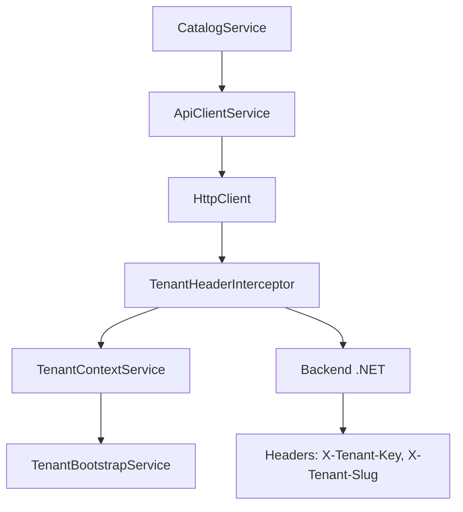

# Sistema HTTP Multi-tenant con Interceptors

Este documento describe el sistema de HTTP interceptors con conciencia multi-tenant para automatizar el envío de headers de tenant en todas las requests HTTP.

## 📋 Resumen

El sistema permite que **todas las requests HTTP** incluyan automáticamente headers de tenant sin necesidad de configurar manualmente cada servicio. Utiliza:

1. **`TenantContextService`** - Servicio de contexto que expone información del tenant
2. **`TenantHeaderInterceptor`** - Interceptor que añade headers automáticamente
3. **`ApiClientService`** - Cliente HTTP que simplifica las requests
4. **Configuración automática** vía providers en `app.config.ts`

## 🏗️ Arquitectura



## 🔧 Componentes

### 1. TenantContextService

**Ubicación**: `/core/src/lib/services/tenant-context.service.ts`

Servicio que actúa como capa de abstracción sobre `TenantBootstrapService` para uso en interceptors:

```typescript
@Injectable({ providedIn: 'root' })
export class TenantContextService {
  // Signals computados (se actualizan automáticamente)
  readonly tenantSlug = computed(() => /* ... */);
  readonly tenantKey = computed(() => /* ... */);
  readonly isReady = computed(() => /* ... */);

  // Métodos principales
  getTenantSlug(): string | null
  getTenantKey(): string | null
  isTenantReady(): boolean
  getCurrentTenantConfig(): TenantConfig | null
  getTenantHeaders(): { slug: string | null; key: string | null }
  shouldIncludeTenantHeaders(url: string): boolean
  waitForTenant(timeoutMs = 5000): Promise<void>
}
```

#### Características:

- **Signals reactivos** que se actualizan automáticamente
- **Lógica de URLs** para determinar qué requests necesitan headers
- **Método de espera** para casos donde se necesita garantizar que el tenant esté cargado
- **Compatibilidad con RxJS** mediante observables

### 2. TenantHeaderInterceptor

**Ubicación**: `/core/src/lib/interceptors/tenant-header.interceptor.ts`

Interceptor que añade automáticamente headers de tenant a requests HTTP:

```typescript
@Injectable()
export class TenantHeaderInterceptor implements HttpInterceptor {
  intercept(req: HttpRequest<any>, next: HttpHandler): Observable<HttpEvent<any>> {
    // Verifica si la URL necesita headers de tenant
    // Añade X-Tenant-Slug y X-Tenant-Key automáticamente
    // Maneja caso borde cuando el tenant no está cargado aún
  }
}
```

#### Lógica de URLs:

- ✅ **Incluye headers**: `/api/catalog/*`, `/api/orders/*`, etc.
- ❌ **Excluye headers**: `/api/public/*`, `/api/health`, URLs externas
- 🔍 **Customizable** via `shouldIncludeTenantHeaders()`

#### Headers generados:

```http
X-Tenant-Slug: demo-a
X-Tenant-Key: tenant-123-uuid
Content-Type: application/json
```

### 3. ApiClientService

**Ubicación**: `/core/src/lib/services/api-client.service.ts`

Cliente HTTP que simplifica las requests y se beneficia automáticamente del interceptor:

```typescript
@Injectable({ providedIn: 'root' })
export class ApiClientService {
  // Métodos básicos
  get<T>(url: string, options?): Observable<T>
  post<T>(url: string, body: any, options?): Observable<T>
  put<T>(url: string, body: any, options?): Observable<T>
  patch<T>(url: string, body: any, options?): Observable<T>
  delete<T>(url: string, options?): Observable<T>

  // Métodos con respuesta completa
  getWithResponse<T>(...): Observable<HttpResponse<T>>
  postWithResponse<T>(...): Observable<HttpResponse<T>>

  // Métodos de conveniencia
  getWithParams<T>(url: string, params: Record<string, any>): Observable<T>
  postWithHeaders<T>(url: string, body: any, headers: Record<string, string>): Observable<T>

  // Utilidades
  buildParams(params: Record<string, any>): HttpParams
  buildHeaders(headers: Record<string, string>): HttpHeaders
}
```

#### Ventajas:

- **Headers automáticos** vía interceptor
- **Métodos tipados** para mejor DX
- **Builders de parámetros** para query strings
- **Respuestas completas** cuando se necesiten headers de respuesta

## 🔧 Configuración

### app.config.ts

```typescript
import { 
  provideTenantHeaderInterceptor,
  TenantBootstrapService 
} from '@pwa/core';

export const appConfig: ApplicationConfig = {
  providers: [
    // HTTP Client
    provideHttpClient(withFetch(), withInterceptors([])),
    
    // ⚠️ IMPORTANTE: Registrar el interceptor de tenant
    provideTenantHeaderInterceptor(),
    
    // Bootstrap del tenant
    {
      provide: APP_INITIALIZER,
      multi: true,
      useFactory: tenantBootstrapFactory,
    },
    
    // ... otros providers
  ],
};
```

### Factory de Bootstrap

```typescript
export function tenantBootstrapFactory(): () => Promise<void> {
  const tenantBootstrap = inject(TenantBootstrapService);
  // ... otros servicios

  return async (): Promise<void> => {
    await tenantBootstrap.initialize();
    // ... aplicar configuración a otros servicios
  };
}
```

## 💻 Uso Práctico

### Servicio de Catálogo Mejorado

```typescript
@Injectable({ providedIn: 'root' })
export class CatalogService {
  private readonly apiClient = inject(ApiClientService);
  private readonly tenantContext = inject(TenantContextService);

  // ✨ Sin headers manuales - se añaden automáticamente
  getProducts(page = 1, pageSize = 20, filters?: ProductFilters) {
    const params = { page, pageSize, ...filters };
    return this.apiClient.getWithParams<CatalogApiResponse<CatalogProduct>>(
      '/api/catalog/products',
      params
    );
  }

  getProduct(productId: string) {
    return this.apiClient.get<CatalogProduct>(`/api/catalog/products/${productId}`);
  }

  searchProducts(query: string, filters?: ProductFilters) {
    const params = { q: query, ...filters };
    return this.apiClient.getWithParams<CatalogApiResponse<CatalogProduct>>(
      '/api/catalog/search',
      params
    );
  }

  // Utilidades del tenant
  getCurrentTenantInfo() {
    const config = this.tenantContext.getCurrentTenantConfig();
    return config ? {
      id: config.tenant.id,
      slug: config.tenant.slug,
      displayName: config.tenant.displayName,
      currency: config.currency,
      locale: config.locale,
      cdnBaseUrl: config.cdnBaseUrl
    } : null;
  }

  buildImageUrl(imagePath: string): string {
    const config = this.tenantContext.getCurrentTenantConfig();
    if (!config?.cdnBaseUrl) return imagePath;
    
    if (imagePath.startsWith('http')) return imagePath;
    
    const cdnBase = config.cdnBaseUrl.endsWith('/') ? 
      config.cdnBaseUrl : `${config.cdnBaseUrl}/`;
    const cleanPath = imagePath.startsWith('/') ? 
      imagePath.substring(1) : imagePath;
    
    return `${cdnBase}${cleanPath}`;
  }
}
```

### Componente de Ejemplo

```typescript
@Component({
  template: `
    <div class="products">
      @for (product of products(); track product.id) {
        <div class="product-card tenant-card">
          
          <h3>{{ product.name }}</h3>
          <div class="price tenant-text-primary">
            {{ formatPrice(product.price) }}
          </div>
        </div>
      }
    </div>
  `
})
export class ProductListComponent implements OnInit {
  private readonly catalogService = inject(CatalogService);
  private readonly tenantContext = inject(TenantContextService);

  readonly products = signal<CatalogProduct[]>([]);
  readonly tenantCurrency = computed(() => 
    this.tenantContext.getCurrentTenantConfig()?.currency ?? 'USD'
  );

  ngOnInit() {
    // ✨ Request automática con headers de tenant
    this.catalogService.getFeaturedProducts(12).subscribe(response => {
      if (response.success) {
        this.products.set(response.data);
      }
    });
  }

  formatPrice(price: number): string {
    const currency = this.tenantCurrency();
    const locale = this.tenantContext.getCurrentTenantConfig()?.locale ?? 'es-CO';
    
    return new Intl.NumberFormat(locale, {
      style: 'currency',
      currency: currency
    }).format(price);
  }

  buildProductImageUrl(imageUrl: string): string {
    return this.catalogService.buildImageUrl(imageUrl);
  }
}
```

## 🔍 Debugging y Monitoreo

### Logs en Desarrollo

El interceptor incluye logs automáticos en modo desarrollo:

```javascript
// En consola del navegador
[TenantHeaderInterceptor] GET /api/catalog/products {
  slug: "demo-a",
  key: "tenant-123-uuid",
  headers: {
    "X-Tenant-Slug": "demo-a",
    "X-Tenant-Key": "tenant-123-uuid"
  }
}
```

### Verificación de Headers

```javascript
// En Network tab del DevTools, verificar headers de salida:
// Request Headers:
// X-Tenant-Slug: demo-a
// X-Tenant-Key: tenant-123-uuid
// Content-Type: application/json
```

### Estado del Tenant

```typescript
// En cualquier componente
const tenantContext = inject(TenantContextService);

console.log('Tenant ready:', tenantContext.isTenantReady());
console.log('Tenant slug:', tenantContext.getTenantSlug());
console.log('Tenant headers:', tenantContext.getTenantHeaders());
```

## 🚨 Manejo de Casos Borde

### 1. Tenant No Cargado Aún

```typescript
// El interceptor maneja automáticamente este caso
if (!tenantHeaders.slug && !tenantHeaders.key) {
  console.warn(`No hay tenant cargado para ${req.url}`);
  return next.handle(req); // Continúa sin headers
}
```

### 2. Esperar a que el Tenant Esté Listo

```typescript
// En servicios que requieren tenant obligatorio
async loadCriticalData() {
  await this.tenantContext.waitForTenant(5000);
  return this.apiClient.get('/api/critical-data');
}
```

### 3. URLs Públicas

```typescript
// Automáticamente excluidas del interceptor
/api/public/tenant/resolve  ❌ (no headers)
/api/health                 ❌ (no headers)  
/api/catalog/products       ✅ (con headers)
https://external-api.com    ❌ (no headers)
```

## 📊 Backend .NET Integration

El backend debe leer los headers enviados:

```csharp
// En controllers .NET
[HttpGet]
public async Task<IActionResult> GetProducts()
{
    var tenantSlug = HttpContext.Request.Headers["X-Tenant-Slug"].FirstOrDefault();
    var tenantKey = HttpContext.Request.Headers["X-Tenant-Key"].FirstOrDefault();
    
    // Usar tenantKey para resolver conexión a DB
    var connectionString = _tenantResolver.GetConnectionString(tenantKey);
    
    // ... lógica del endpoint
}
```

## ✅ Beneficios

1. **🔄 Automático**: Headers se añaden sin intervención manual
2. **🎯 Selectivo**: Solo URLs de API obtienen headers
3. **🛡️ Robusto**: Maneja casos borde gracefulmente
4. **🔧 Configurable**: Lógica de URLs customizable
5. **📈 Escalable**: Un interceptor para toda la app
6. **🐛 Debuggeable**: Logs automáticos en desarrollo
7. **⚡ Performante**: Signals reactivos, sin subscripciones manuales

## 🧪 Testing

### Unit Tests

```typescript
describe('TenantHeaderInterceptor', () => {
  it('should add tenant headers to API requests', () => {
    // Mock TenantContextService
    // Test interceptor logic
    // Verify headers are added
  });

  it('should skip public URLs', () => {
    // Test /api/public/* URLs
    // Verify no headers added
  });
});
```

### Integration Tests

```typescript
describe('CatalogService', () => {
  it('should make requests with tenant headers', () => {
    // Mock HttpClient
    // Call service method
    // Verify interceptor was triggered
    // Verify correct headers sent
  });
});
```

---

**¡Sistema completo de HTTP interceptors multi-tenant implementado! 🚀**
