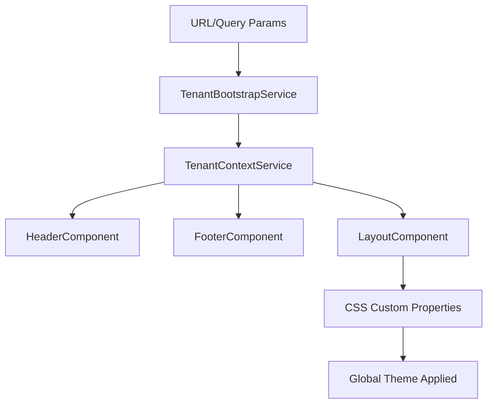

# 🎨 Multi-Tenant Branding System

Sistema completo de branding multi-tenant para PWA Angular 20+ con componentes de layout dinámicos.

## 📋 Características

### ✅ **HeaderComponent**
- 🔧 Obtiene `logoUrl`, `displayName` y colores del `TenantContextService`
- 🎨 Actualiza dinámicamente estilos via CSS custom properties
- 🖼️ Soporte completo para imágenes por tenant desde backend
- 📱 Responsive design con menú móvil
- 🛒 Iconos de carrito y usuario integrados
- ♿ Accesibilidad completa (ARIA labels, navegación por teclado)

### ✅ **FooterComponent**
- 📝 Refleja automáticamente el nombre del tenant
- 📞 Información de contacto dinámica por tenant
- 🌐 Links de redes sociales configurables
- 📄 Links de navegación organizados por categorías
- 🔧 Información de debug del tenant (solo desarrollo)

### ✅ **LayoutComponent**
- 🏗️ Contiene `<app-header>` y `<app-footer>`
- 🎨 Aplica theme del tenant al `<body>` via CSS variables
- ⚡ Loading states globales
- 🔝 Botón "Back to top" automático
- 📱 Meta theme-color para navegadores móviles
- 🎯 Integración completa con el sistema multi-tenant existente

### ✅ **Reactive System**
- 🔄 Reacciona automáticamente cuando cambia el tenant (`?tenant=demo-b`)
- ⚡ Powered by Angular Signals para máximo rendimiento
- 🎨 CSS custom properties actualizadas en tiempo real
- 📊 Estados de carga y error manejados automáticamente

## 🚀 Instalación y Uso

### 1. **Importar en tu AppComponent**

```typescript
import { Component, OnInit, inject } from '@angular/core';
import { TenantBootstrapService } from '@pwa/core';
import { LayoutComponent } from '@pwa/shared';

@Component({
  selector: 'app-root',
  standalone: true,
  imports: [LayoutComponent],
  template: `<app-layout></app-layout>`
})
export class AppComponent implements OnInit {
  private readonly tenantBootstrap = inject(TenantBootstrapService);

  async ngOnInit(): Promise<void> {
    await this.tenantBootstrap.initialize();
  }
}
```

### 2. **Configurar Tenants** (ver `tenant-configs.example.ts`)

```typescript
const tenantConfig: TenantConfig = {
  tenant: {
    id: 'tenant-uuid',
    slug: 'demo-a',
    displayName: 'TechStore Pro',
    description: 'La mejor tienda de tecnología...',
    contact: {
      email: 'contacto@techstore-pro.com',
      phone: '+1 (555) 123-4567'
    },
    socialLinks: {
      facebook: 'https://facebook.com/techstore-pro',
      instagram: 'https://instagram.com/techstore.pro'
    },
    branding: {
      primaryColor: '#2563eb',
      secondaryColor: '#475569', 
      accentColor: '#dc2626',
      backgroundColor: '#ffffff',
      textColor: '#1e293b',
      logoUrl: 'https://cdn.techstore-pro.com/logo.svg'
    }
  },
  // ... resto de configuración
};
```

### 3. **CSS Variables Disponibles**

El sistema genera automáticamente estas CSS custom properties:

```css
:root {
  /* Colores principales */
  --tenant-primary-color: #2563eb;
  --tenant-secondary-color: #475569;
  --tenant-accent-color: #dc2626;
  --tenant-background-color: #ffffff;
  --tenant-text-color: #1e293b;
  
  /* Colores derivados */
  --tenant-primary-hover: #1d4ed8;
  --tenant-primary-light: rgba(37, 99, 235, 0.1);
  --tenant-border-color: rgba(31, 41, 55, 0.2);
  
  /* Layout específico */
  --tenant-header-bg: #ffffff;
  --tenant-header-shadow: 0 1px 3px rgba(0, 0, 0, 0.1);
}
```

## 🎯 Testing de Tenants

### URLs de Prueba

```bash
# Tenant A - TechStore Pro (Azul)
http://localhost:4200?tenant=demo-a
# o
http://demo-a.localhost:4200

# Tenant B - Fashion World (Rosa)  
http://localhost:4200?tenant=demo-b
# o
http://demo-b.localhost:4200

# Tenant C - Green Garden (Verde)
http://localhost:4200?tenant=demo-c
# o  
http://demo-c.localhost:4200
```

### Cambio Dinámico de Tenant

```typescript
// El sistema reacciona automáticamente a cambios en la URL
window.location.href = '?tenant=demo-b';

// O programáticamente via TenantBootstrapService
const tenantBootstrap = inject(TenantBootstrapService);
await tenantBootstrap.switchTenant('demo-b');
```

## 🏗️ Arquitectura

### Flujo de Datos



### Componentes y Servicios

```
/shared/src/lib/ui/
├── header/
│   ├── header.component.ts     # Header con branding dinámico
│   └── index.ts               # Barrel export
├── footer/ 
│   ├── footer.component.ts     # Footer con info del tenant
│   └── index.ts               # Barrel export
└── layout/
    ├── layout.component.ts     # Layout principal
    └── index.ts               # Barrel export

/core/src/lib/
├── services/
│   ├── tenant-bootstrap.service.ts  # Inicialización de tenant
│   └── tenant-context.service.ts    # Contexto reactivo
└── models/
    └── types.ts                     # Interfaces actualizadas
```

## 🎨 Personalización Avanzada

### CSS por Tenant

```scss
/* Estilos específicos por tenant */
.tenant-demo-a {
  --tenant-border-radius: 8px;
  --tenant-shadow-lg: 0 10px 15px -3px rgba(0, 0, 0, 0.1);
}

.tenant-demo-b {  
  --tenant-border-radius: 12px;
  --tenant-shadow-lg: 0 20px 25px -5px rgba(0, 0, 0, 0.1);
}

.tenant-demo-b .app-header {
  border-bottom: 2px solid var(--tenant-primary-color);
}
```

### Componentes Personalizados

```typescript
// Usar las CSS variables en tus componentes
@Component({
  template: `
    <div class="custom-card">
      <h3 style="color: var(--tenant-primary-color)">{{ title }}</h3>
      <button class="btn-primary">Action</button>
    </div>
  `,
  styles: [`
    .custom-card {
      border: 1px solid var(--tenant-border-color);
      border-radius: var(--tenant-border-radius, 8px);
      background: var(--tenant-background-color);
    }
    
    .btn-primary {
      background: var(--tenant-primary-color);
      border-radius: var(--tenant-border-radius, 6px);
    }
  `]
})
export class CustomComponent { }
```

## 📱 PWA Features

### Meta Theme Color
El sistema actualiza automáticamente el `theme-color` para navegadores móviles:

```html
<meta name="theme-color" content="#2563eb">
```

### Responsive Design
- 📱 Mobile-first approach
- 🖥️ Breakpoints optimizados
- 🍔 Hamburger menu para móviles
- 👆 Touch-friendly interactions

### Accessibility
- ♿ ARIA labels en todos los elementos interactivos
- ⌨️ Navegación completa por teclado
- 🔍 High contrast mode support
- 🎭 Reduced motion support

## 🐛 Debug y Desarrollo

### Debug Mode
En desarrollo, el `LayoutComponent` muestra información de debug:

```json
{
  "slug": "demo-a",
  "displayName": "TechStore Pro", 
  "branding": { "primaryColor": "#2563eb" },
  "loadedAt": "2025-11-13T10:30:00Z"
}
```

### Logs del Sistema
```typescript
// TenantBootstrapService logs automáticamente:
console.log('✅ Tenant initialized:', tenantConfig);
console.log('🎨 Branding applied:', branding);
console.error('❌ Error loading tenant:', error);
```

## 🔧 Troubleshooting

### Problemas Comunes

1. **Logo no carga**: Verificar CORS y URL válida
2. **Colores no aplican**: Revisar formato hex válido
3. **Tenant no encontrado**: Verificar slug en configuración
4. **CSS no actualiza**: Limpiar caché del navegador

### Performance

- ✅ CSS custom properties (mejor que clases dinámicas)
- ✅ Computed signals (re-cálculo mínimo)
- ✅ Lazy loading de imágenes
- ✅ Debounce en cambios de tenant

## 🚀 Próximos Pasos

1. **Integrar con routing**: Añadir rutas del catálogo
2. **Testing**: Unit tests para componentes
3. **Storybook**: Documentación visual
4. **Internacionalización**: Soporte multi-idioma
5. **Dark mode**: Theme switching automático

---

**🎉 ¡Sistema de branding multi-tenant completamente funcional!**

El layout ahora reacciona dinámicamente a cambios de tenant con branding completo, CSS variables automáticas y componentes responsive listos para producción.
