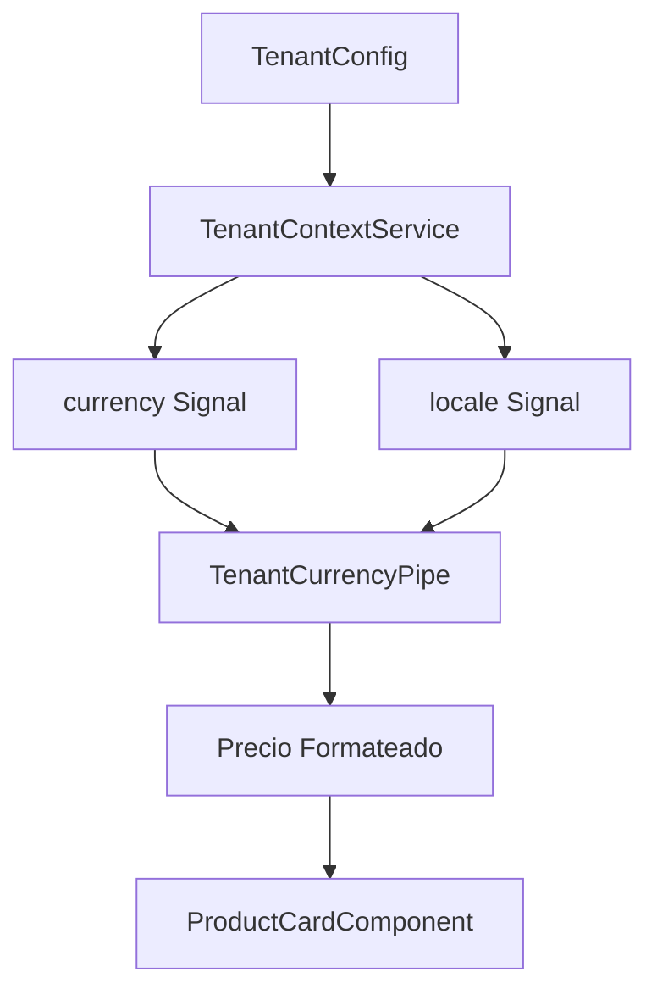

# 💰 Sistema de Monedas Multi-tenant

## Descripción General

El sistema de monedas multi-tenant permite que cada tenant tenga su propia configuración de moneda y formato regional, automatizando la presentación de precios y números según las preferencias locales de cada inquilino.

## Arquitectura

### Componentes Principales

1. **TenantContextService** - Gestión de configuración regional del tenant
2. **TenantCurrencyPipe** - Formateo de monedas con configuración automática
3. **TenantCurrencySymbolPipe** - Extracción de símbolos de moneda
4. **TenantNumberPipe** - Formateo de números según locale

### Flujo de Datos



## Configuración del Tenant

### Propiedades Agregadas al TenantConfig

```typescript
export interface TenantConfig {
  // ... propiedades existentes
  locale: string; // ej: 'en-US', 'es-ES', 'es-MX'
  currency: string; // ej: 'USD', 'EUR', 'MXN'
}
```

### Signals Computados en TenantContextService

```typescript
// Nuevas propiedades agregadas
readonly currency = computed(() =>
  this.tenantBootstrap.currentTenant()?.currency ?? 'USD'
);

readonly locale = computed(() =>
  this.tenantBootstrap.currentTenant()?.locale ?? 'en-US'
);
```

## Pipes Implementados

### 1. TenantCurrencyPipe

**Propósito:** Formatear precios según la moneda y locale del tenant actual.

**Uso:**

```html
<!-- Formato básico -->
{{ price | tenantCurrency }}

<!-- Con opciones personalizadas -->
{{ price | tenantCurrency:'symbol':'1.2-2' }} {{ price | tenantCurrency:'code' }} {{ price | tenantCurrency:'symbol-narrow':'1.0-0' }}
```

**Características:**

- ✅ **Reactividad automática** - Se actualiza cuando cambia el tenant
- ✅ **Configuración por moneda** - Decimales apropiados según tipo de moneda
- ✅ **Fallback seguro** - Manejo de errores con formato básico
- ✅ **Tipado completo** - Support para TypeScript

**Configuración automática de decimales:**

```typescript
const currencyDefaults: Record<string, string> = {
  JPY: '1.0-0', // Sin decimales
  KRW: '1.0-0', // Sin decimales
  USD: '1.2-2', // 2 decimales
  EUR: '1.2-2', // 2 decimales
  BHD: '1.3-3', // 3 decimales
  // ... más configuraciones
};
```

### 2. TenantCurrencySymbolPipe

**Propósito:** Obtener solo el símbolo de la moneda del tenant.

**Uso:**

```html
<span class="currency-symbol">{{ '' | tenantCurrencySymbol }}</span>
```

**Resultados por tenant:**

- USD → $
- EUR → €
- GBP → £
- JPY → ¥

### 3. TenantNumberPipe

**Propósito:** Formatear números según el locale del tenant.

**Uso:**

```html
{{ stockCount | tenantNumber }} {{ percentage | tenantNumber:'1.1-1' }}
```

**Ejemplos de formateo:**

```typescript
// Locale: en-US
1234567.89 → "1,234,567.89"

// Locale: es-ES
1234567.89 → "1.234.567,89"

// Locale: es-MX
1234567.89 → "1,234,567.89"
```

## Integración en Componentes

### ProductCardComponent

**Antes:**

```typescript
readonly formattedPrice = computed(() => {
  // Lógica manual de formateo
  return new Intl.NumberFormat(locale, {
    style: 'currency',
    currency: currency
  }).format(price);
});
```

**Después:**

```html
<!-- Template simplificado -->
<span class="product-price"> {{ product().price | tenantCurrency }} </span>
```

**Beneficios:**

- ✅ Menos código en el componente
- ✅ Reactividad automática
- ✅ Consistencia en toda la aplicación
- ✅ Manejo de errores centralizado

### CatalogPageComponent

El `CatalogPageComponent` se beneficia automáticamente al usar `ProductCardComponent`:

```html
<!-- Los precios se formatean automáticamente -->
<app-product-card *ngFor="let product of products()" [product]="product"> </app-product-card>
```

## Ejemplos por Locale/Moneda

### Configuraciones Soportadas

| Tenant       | Locale | Currency | Ejemplo Precio | Resultado   |
| ------------ | ------ | -------- | -------------- | ----------- |
| US Store     | en-US  | USD      | 29.99          | $29.99      |
| EU Store     | es-ES  | EUR      | 29.99          | 29,99 €     |
| Mexico Store | es-MX  | MXN      | 599.50         | $599.50 MXN |
| Japan Store  | ja-JP  | JPY      | 2999           | ¥2,999      |
| UK Store     | en-GB  | GBP      | 24.99          | £24.99      |
| Brazil Store | pt-BR  | BRL      | 149.90         | R$ 149,90   |

### Características Especiales

**Monedas sin decimales:**

```typescript
// JPY, KRW, VND, CLP automáticamente sin decimales
{
  {
    1500 | tenantCurrency;
  }
}
// Resultado con JPY: ¥1,500 (no ¥1,500.00)
```

**Monedas con 3 decimales:**

```typescript
// BHD, JOD, KWD automáticamente con 3 decimales
{
  {
    29.999 | tenantCurrency;
  }
}
// Resultado con BHD: BD 29.999
```

## Testing

### Test Unitarios

```typescript
// Test básico
it('debe formatear precio USD correctamente', () => {
  mockTenant.locale.and.returnValue('en-US');
  mockTenant.currency.and.returnValue('USD');

  const result = pipe.transform(29.99);
  expect(result).toBe('$29.99');
});

// Test de reactividad
it('debe actualizar formato cuando cambia tenant', () => {
  // Configuración inicial US
  mockTenant.locale.and.returnValue('en-US');
  mockTenant.currency.and.returnValue('USD');
  expect(pipe.transform(99.99)).toBe('$99.99');

  // Cambio a EU
  mockTenant.locale.and.returnValue('es-ES');
  mockTenant.currency.and.returnValue('EUR');
  expect(pipe.transform(99.99)).toContain('€');
});
```

### Demo Interactiva

**Ruta:** `/tenant/currency-demo`

La demo incluye:

- 🏢 Configuración actual del tenant
- 🌍 Simulador de diferentes tenants
- 🧪 Prueba interactiva con input personalizable
- 🛍️ Productos de ejemplo con precios reales
- ⚙️ Información técnica del sistema

## Performance

### Optimizaciones Implementadas

1. **Pure: false** - Solo se recalcula cuando cambian los signals del tenant
2. **Signals computados** - Actualizaciones eficientes y automáticas
3. **Fallback rápido** - Manejo de errores sin bloqueo
4. **Configuración estática** - Mapeos pre-calculados por moneda

### Consideraciones

- ✅ **Reactividad eficiente** - Usa signals de Angular para updates mínimos
- ✅ **Cacheado implícito** - Los computed signals cachean automáticamente
- ✅ **Manejo de errores** - Fallbacks que no afectan performance
- ⚠️ **Pure: false** - Necesario para reactividad, pero requiere cuidado en uso

## Extensibilidad

### Agregar Nueva Moneda

1. **Configurar tenant:**

```typescript
{
  locale: 'hi-IN',
  currency: 'INR'
}
```

2. **Opcional - Configurar decimales:**

```typescript
// En tenant-currency.pipe.ts
const currencyDefaults: Record<string, string> = {
  // ... existentes
  INR: '1.2-2', // Rupias indias con 2 decimales
};
```

### Personalizar Formato

```html
<!-- Formato personalizado por uso -->
{{ price | tenantCurrency:'symbol-narrow':'1.0-0' }}

<!-- Con locale específico (override temporal) -->
{{ price | tenantCurrency:'symbol':'1.2-2':'ja-JP' }}
```

## Troubleshooting

### Errores Comunes

1. **Pipe no actualiza al cambiar tenant**

   - ✅ Verificar que el pipe tenga `pure: false`
   - ✅ Confirmar que TenantContextService use signals

2. **Formato incorrecto**

   - ✅ Validar configuración `locale` y `currency` en tenant
   - ✅ Revisar que los valores sean códigos válidos (ISO)

3. **Error en navegadores antiguos**
   - ✅ Fallback automático implementado
   - ✅ Verificar polyfills de Intl.NumberFormat

### Debug

```typescript
// En consola del navegador
testCurrencyPipes(); // Ejecuta tests manuales

// Verificar configuración actual
tenantContext.getCurrency(); // Moneda actual
tenantContext.getLocale(); // Locale actual
```

## Próximas Mejoras

- [ ] **Cache avanzado** - Memoización de formateos frecuentes
- [ ] **Configuración custom** - Permitir override por componente
- [ ] **Monedas alternativas** - Soporte para múltiples monedas por tenant
- [ ] **Formateo contextual** - Diferente formato para lista vs detalle
- [ ] **Redondeo inteligente** - Reglas de negocio por tipo de producto

---

**✨ El sistema de monedas multi-tenant está completamente implementado y listo para producción!**
