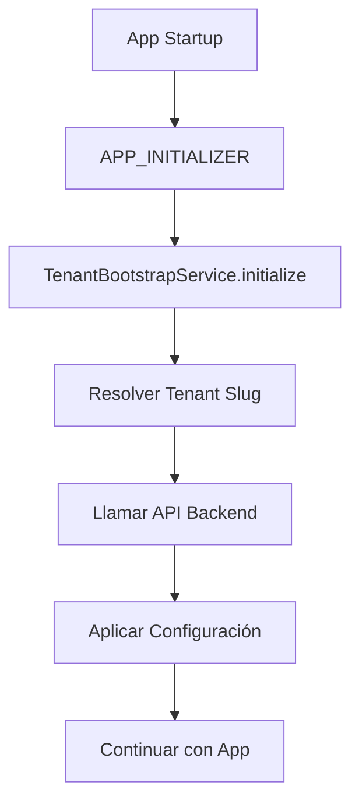

# Sistema Multi-tenant PWA Angular

Este documento describe la implementación del sistema multi-tenant para el PWA de eCommerce usando Angular 20+.

## 📋 Resumen

El sistema permite que una sola aplicación Angular sirva a múltiples tenants (inquilinos) con diferentes configuraciones visuales y de negocio, determinando automáticamente el tenant activo basado en:

1. **Query parameter** `?tenant=slug`
2. **Subdomain** (ej: `tenant1.miapp.com`)
3. **Hostname completo** (dominios personalizados)
4. **Tenant por defecto** como fallback

## 🏗️ Arquitectura

### Componentes Principales

1. **`TenantBootstrapService`** - Servicio principal que maneja la resolución y configuración del tenant
2. **`APP_INITIALIZER`** - Provider que ejecuta el bootstrap antes de la inicialización de la app
3. **Interfaces** - Definiciones de tipos para la configuración del tenant
4. **CSS Variables** - Sistema de temas dinámicos usando CSS custom properties

### Flujo de Inicialización



## 🚀 Implementación

### 1. Interfaces del Tenant

Las interfaces principales están definidas en `/core/src/lib/models/types.ts`:

```typescript
export interface TenantConfig {
  tenant: TenantInfo;
  theme: ThemeConfig;
  features: Record<string, boolean>;
  limits: { products: number; admins: number; storageMB: number };
  locale: string;
  currency: string;
  cdnBaseUrl: string;
}

export interface TenantInfo {
  id: string; // ID interno para el backend
  slug: string; // Slug público del tenant
  displayName: string; // Nombre para mostrar
}

export interface ThemeConfig {
  primary: string; // Color primario
  accent: string; // Color de acento
  logoUrl: string; // URL del logo
  faviconUrl?: string; // URL del favicon
  cssVars?: Record<string, string>; // Variables CSS personalizadas
  enableDark?: boolean;
  background?: string;
  textColor?: string;
}
```

### 2. TenantBootstrapService

Ubicado en `/core/src/lib/services/tenant-bootstrap.service.ts`, este servicio:

- **Resuelve el tenant activo** usando múltiples estrategias
- **Llama al endpoint del backend** `/api/public/tenant/resolve?tenant=slug`
- **Aplica la configuración** al DOM (CSS variables, meta tags, título)
- **Maneja errores** con fallback a configuración por defecto

#### Métodos Principales

```typescript
// Inicializar el bootstrap (llamado por APP_INITIALIZER)
await tenantBootstrapService.initialize();

// Obtener información del tenant actual
const slug = tenantBootstrapService.getTenantSlug();
const id = tenantBootstrapService.getTenantId();
const config = tenantBootstrapService.getTenantConfig();

// Verificar si el tenant está cargado
const isReady = tenantBootstrapService.isTenantLoaded();

// Recargar configuración
await tenantBootstrapService.reloadTenant();
```

### 3. Configuración del Bootstrap

En `app.config.ts`, se configura el `APP_INITIALIZER`:

```typescript
import { TenantBootstrapService, provideTenantBootstrap } from '@pwa/core';

export const appConfig: ApplicationConfig = {
  providers: [
    // ... otros providers

    // Opción 1: Usar el provider directo
    provideTenantBootstrap(),

    // Opción 2: Integración personalizada con servicios existentes
    {
      provide: APP_INITIALIZER,
      multi: true,
      useFactory: enhancedTenantBootstrapFactory,
    },
  ],
};
```

### 4. Uso en Servicios

Ejemplo de cómo usar el bootstrap en otros servicios:

```typescript
import { TenantBootstrapService } from '@pwa/core';

@Injectable()
export class CatalogService {
  private readonly tenantBootstrap = inject(TenantBootstrapService);

  getProducts(): Observable<Product[]> {
    // Obtener headers con información del tenant
    const headers = this.getTenantHeaders();

    return this.http.get<Product[]>('/api/catalog/products', { headers });
  }

  private getTenantHeaders(): HttpHeaders {
    const tenantId = this.tenantBootstrap.getTenantId();

    return new HttpHeaders({
      'Content-Type': 'application/json',
      'X-Tenant-ID': tenantId || 'default',
    });
  }
}
```

## 🎨 Sistema de Temas

### Variables CSS Dinámicas

El sistema aplica automáticamente variables CSS que pueden ser usadas en componentes:

```scss
:root {
  --tenant-primary-color: #1976d2;
  --tenant-accent-color: #dc004e;
  --tenant-background-color: #ffffff;
  --tenant-text-color: #333333;
}
```

### Clases Utilitarias

```scss
.tenant-bg-primary {
  background-color: var(--tenant-primary-color);
}
.tenant-text-primary {
  color: var(--tenant-primary-color);
}
.tenant-btn-primary {
  /* Botón con estilo del tenant */
}
```

### Uso en Componentes

```typescript
@Component({
  template: `
    <header class="tenant-header">
      
      <h1 class="tenant-text-primary">{{ tenantName }}</h1>
    </header>

    <button class="tenant-btn-primary">Comprar Ahora</button>
  `,
})
export class HeaderComponent {
  private readonly tenantBootstrap = inject(TenantBootstrapService);

  get logoUrl() {
    return this.tenantBootstrap.getTenantConfig()?.theme.logoUrl;
  }

  get tenantName() {
    return this.tenantBootstrap.getTenantConfig()?.tenant.displayName;
  }
}
```

## 🌐 Endpoint del Backend

El servicio espera un endpoint público que retorne la configuración del tenant:

### Request

```
GET /api/public/tenant/resolve?tenant=demo-a
```

### Response

```json
{
  "success": true,
  "data": {
    "tenant": {
      "id": "tenant-123",
      "slug": "demo-a",
      "displayName": "Demo Store A"
    },
    "theme": {
      "primary": "#1976d2",
      "accent": "#dc004e",
      "logoUrl": "https://cdn.example.com/logo-a.png",
      "faviconUrl": "https://cdn.example.com/favicon-a.ico"
    },
    "features": {
      "enableChat": true,
      "enableWishlist": false
    },
    "limits": {
      "products": 1000,
      "admins": 5,
      "storageMB": 500
    },
    "locale": "es-CO",
    "currency": "COP",
    "cdnBaseUrl": "https://cdn-a.example.com"
  }
}
```

## 🔧 Configuración del Backend

Para que el backend funcione correctamente con este sistema:

1. **Headers a leer**: `X-Tenant-ID`, `X-Tenant-Slug`
2. **Conexión a DB**: Usar el `tenant.id` para conectar a la base de datos correcta
3. **CDN**: Configurar URLs base según el tenant
4. **CORS**: Permitir los subdominios y dominios personalizados

## 📱 PWA y Meta Tags

El sistema automáticamente configura:

- **Título de la página** con el nombre del tenant
- **Meta description** personalizada
- **Theme color** para PWA con el color primario
- **Open Graph tags** con logo e información del tenant
- **Favicon** específico del tenant

## 🚨 Manejo de Errores

- Si el tenant no existe → Intenta cargar el tenant por defecto
- Si hay error de red → Usa configuración por defecto local
- Si el endpoint falla → La app continúa funcionando con valores predeterminados

## 📋 Checklist de Implementación

- [x] ✅ Crear interfaces de `TenantConfig`
- [x] ✅ Implementar `TenantBootstrapService`
- [x] ✅ Configurar `APP_INITIALIZER`
- [x] ✅ Crear sistema de CSS variables
- [x] ✅ Ejemplo de uso en servicios
- [ ] 🔄 Configurar endpoint en el backend .NET
- [ ] 🔄 Probar resolución por subdomain
- [ ] 🔄 Probar resolución por query parameter
- [ ] 🔄 Implementar cache de configuraciones
- [ ] 🔄 Agregar tests unitarios

## 🧪 Testing

### Casos de Prueba

1. **Resolución por query param**: `/?tenant=demo-a`
2. **Resolución por subdomain**: `https://demo-a.miapp.com`
3. **Fallback a default**: cuando el tenant no existe
4. **Carga offline**: usar configuración cacheada
5. **Aplicación de tema**: verificar CSS variables
6. **Headers en requests**: verificar `X-Tenant-ID`

### Comandos Útiles

```bash
# Desarrollo local con tenant específico
ng serve --host=demo-a.localhost

# Build con configuración de producción
ng build --configuration=production

# Test de resolución de tenants
curl "http://localhost:4200/api/public/tenant/resolve?tenant=demo-a"
```

## 🔍 Debugging

Para debug, el servicio incluye logs detallados:

```javascript
// En consola del navegador
console.log('Tenant actual:', tenantBootstrapService.getTenantConfig());
console.log('Estrategias probadas:' /* logs internos */);

// Variables CSS aplicadas
console.log(getComputedStyle(document.documentElement).getPropertyValue('--tenant-primary-color'));
```

## 🚀 Próximos Pasos

1. **Cache inteligente** de configuraciones de tenant
2. **Lazy loading** de assets específicos por tenant
3. **A/B testing** por tenant
4. **Analytics** separados por tenant
5. **Internacionalización** avanzada por tenant
6. **SSR optimizado** para SEO por tenant

---

**Desarrollado para PWA eCommerce Multi-tenant con Angular 20+**
