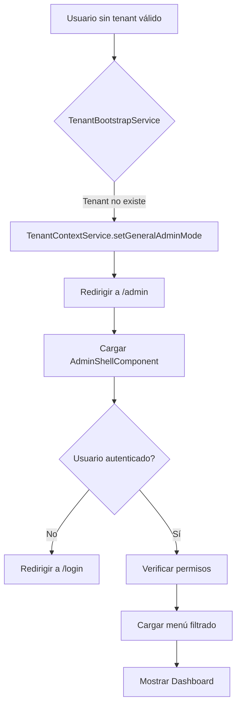
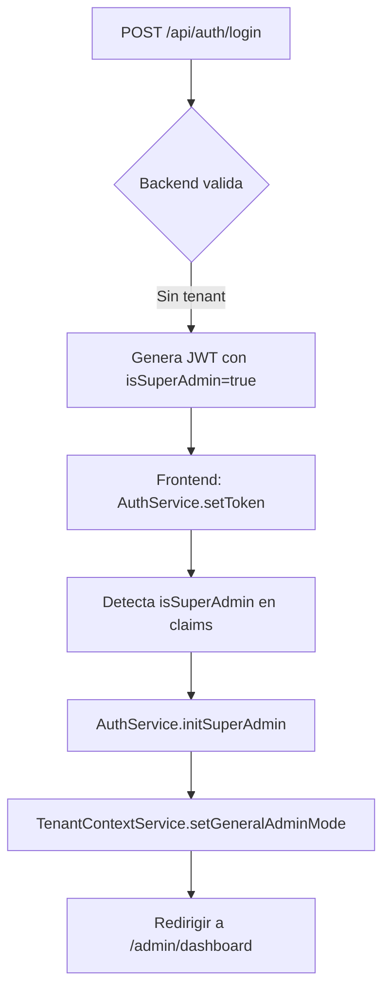
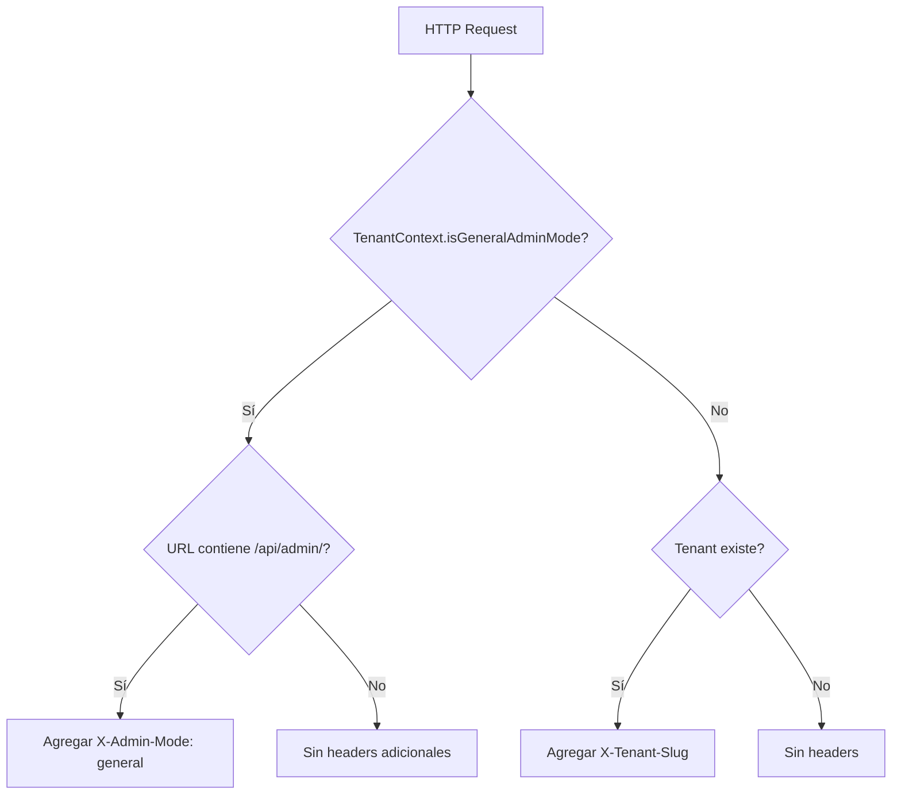

# 🏗️ Módulo de Administración General - Arquitectura y Diseño

## 📋 Índice

1. [Descripción General](#descripción-general)
2. [Arquitectura](#arquitectura)
3. [Estructura de Carpetas](#estructura-de-carpetas)
4. [Flujos Principales](#flujos-principales)
5. [Modelos de Datos](#modelos-de-datos)
6. [Servicios](#servicios)
7. [Guards y Seguridad](#guards-y-seguridad)
8. [Componentes](#componentes)
9. [Integración con el Backend](#integración-con-el-backend)
10. [Guía de Uso](#guía-de-uso)

---

## 📖 Descripción General

El **Módulo de Administración General** (features-superadmin) es el panel de control centralizado para gestionar **TODOS los tenants** de la plataforma. A diferencia de los módulos de administración específicos de cada tenant, este módulo opera en un **contexto global** sin tenant específico.

### Características Principales

- ✅ **Gestión Multi-Tenant**: Administrar todos los tenants desde un solo lugar
- ✅ **Control de Acceso Basado en Roles (RBAC)**: Menú dinámico según permisos
- ✅ **Guards Declarativos**: Protección de rutas con metadata de permisos
- ✅ **Layout Responsive**: Sidebar colapsable con Material Icons
- ✅ **Contexto sin Tenant**: No envía headers X-Tenant-Slug al backend
- ✅ **Standalone Components**: Arquitectura moderna de Angular
- ✅ **Lazy Loading**: Carga bajo demanda de componentes

---

## 🏛️ Arquitectura

### Principios de Diseño

Este módulo sigue los principios de **Clean Architecture** aplicados a un monorepo Nx:

```
┌─────────────────────────────────────────────────────┐
│                  App Layer (PWA)                    │
│              app.routes.ts → /admin                 │
└────────────────────┬────────────────────────────────┘
                     │ Lazy Load
                     ▼
┌─────────────────────────────────────────────────────┐
│          Features-Superadmin (Feature Lib)          │
│  ┌──────────────────────────────────────────────┐   │
│  │  Presentation Layer                          │   │
│  │  - AdminShellComponent (Layout + Sidebar)    │   │
│  │  - AdminDashboardComponent                   │   │
│  │  - Page Components (Placeholders)            │   │
│  └──────────────────────────────────────────────┘   │
│  ┌──────────────────────────────────────────────┐   │
│  │  Business Logic Layer                        │   │
│  │  - AdminMenuService (Menú dinámico)          │   │
│  │  - AdminPermissionGuard (Seguridad)          │   │
│  └──────────────────────────────────────────────┘   │
│  ┌──────────────────────────────────────────────┐   │
│  │  Models & Config                             │   │
│  │  - AdminMenuItem, Permissions                │   │
│  │  - GENERAL_TENANT_CONFIG                     │   │
│  └──────────────────────────────────────────────┘   │
└────────────────────┬────────────────────────────────┘
                     │ Uses
                     ▼
┌─────────────────────────────────────────────────────┐
│              Core (Shared Services)                 │
│  - AuthService (JWT + SuperAdmin support)          │
│  - TenantContextService (General mode)             │
│  - TenantHeaderInterceptor (X-Admin-Mode)          │
└─────────────────────────────────────────────────────┘
```

### Separación de Responsabilidades

| Capa               | Responsabilidad               | Ejemplos                            |
| ------------------ | ----------------------------- | ----------------------------------- |
| **Presentation**   | UI, templates, estilos        | AdminShellComponent, placeholders   |
| **Business Logic** | Lógica de negocio, servicios  | AdminMenuService, guards            |
| **Data Access**    | Comunicación con backend      | ApiClientService (heredado de core) |
| **Models**         | Tipos, interfaces, constantes | AdminMenuItem, Permissions          |

---

## 📁 Estructura de Carpetas

```
features-superadmin/
├── src/
│   ├── index.ts                          # Barrel export
│   └── lib/
│       ├── admin.routes.ts               # ✅ Configuración de rutas
│       │
│       ├── models/                       # ✅ Modelos de datos
│       │   ├── admin-menu.model.ts
│       │   └── admin-auth.model.ts
│       │
│       ├── config/                       # ✅ Configuración
│       │   └── general-tenant.config.ts
│       │
│       ├── services/                     # ✅ Servicios
│       │   └── admin-menu.service.ts
│       │
│       ├── guards/                       # ✅ Guards de seguridad
│       │   └── admin-permission.guard.ts
│       │
│       ├── components/                   # ✅ Componentes principales
│       │   ├── admin-shell/
│       │   │   └── admin-shell.component.ts
│       │   ├── admin-dashboard/
│       │   │   └── admin-dashboard.component.ts
│       │   └── access-denied/
│       │       └── access-denied.component.ts
│       │
│       └── pages/                        # ✅ Páginas (placeholders)
│           └── placeholder.components.ts
│
├── project.json
├── tsconfig.json
├── tsconfig.lib.json
└── README.md
```

### Convenciones de Nombres

- **Components**: `{feature}-{name}.component.ts` (ej: `admin-shell.component.ts`)
- **Services**: `{feature}-{name}.service.ts` (ej: `admin-menu.service.ts`)
- **Models**: `{feature}-{name}.model.ts` (ej: `admin-menu.model.ts`)
- **Guards**: `{feature}-{name}.guard.ts` (ej: `admin-permission.guard.ts`)

---

## 🔄 Flujos Principales

### 1. Flujo de Acceso al Admin



### 2. Flujo de Login del SuperAdmin



### 3. Flujo de Verificación de Permisos

```mermaid
graph TD
    A[Navegar a ruta protegida] --> B[adminPermissionGuard]
    B --> C{Usuario autenticado?}
    C -->|No| D[Redirigir a /login]
    C -->|Sí| E{En modo admin general?}
    E -->|No| F[Denegar acceso]
    E -->|Sí| G{Tiene permisos requeridos?}
    G -->|No| H[/admin/access-denied]
    G -->|Sí| I[Permitir acceso]
```

### 4. Flujo del HTTP Interceptor



---

## 📦 Modelos de Datos

### AdminMenuItem

Define la estructura del menú lateral:

```typescript
interface AdminMenuItem {
  id: string; // Identificador único
  label: string; // Texto visible
  icon?: string; // Material Icon
  route?: string; // Ruta de navegación
  requiredPermissions?: string[]; // Permisos requeridos (AND)
  requiredRoles?: string[]; // Roles requeridos (OR)
  badge?: MenuBadge; // Badge (ej: "NEW", "3")
  children?: AdminMenuItem[]; // Items hijos
  disabled?: boolean; // Si está deshabilitado
  expanded?: boolean; // Si está expandido por defecto
  order?: number; // Orden de aparición
  showDivider?: boolean; // Mostrar separador después
  tooltip?: string; // Tooltip al hacer hover
  external?: boolean; // Si abre en nueva ventana
  cssClass?: string; // Clase CSS personalizada
}
```

### ADMIN_PERMISSIONS

Constantes de permisos del sistema:

```typescript
export const ADMIN_PERMISSIONS = {
  TENANTS: {
    VIEW: 'tenants:view',
    CREATE: 'tenants:create',
    EDIT: 'tenants:edit',
    DELETE: 'tenants:delete',
    CONFIGURE: 'tenants:configure',
  },
  USERS: {
    VIEW: 'users:view',
    CREATE: 'users:create',
    EDIT: 'users:edit',
    DELETE: 'users:delete',
    MANAGE_ROLES: 'users:manage-roles',
  },
  // ... más recursos
} as const;
```

### SuperAdminJwtPayload

Estructura del JWT del superadmin:

```typescript
interface SuperAdminJwtPayload {
  sub: string; // User ID
  email: string; // Email
  name?: string; // Nombre completo
  roles: string[]; // Roles del admin
  permissions: string[]; // Permisos granulares
  exp: number; // Expiration timestamp
  iat: number; // Issued at timestamp
  isSuperAdmin: boolean; // Flag de superadmin
}
```

---

## ⚙️ Servicios

### AdminMenuService

**Responsabilidad**: Gestionar el menú lateral de forma dinámica según los permisos del usuario.

**Características**:

- Filtrado automático de items según permisos
- Soporte para menús jerárquicos (padres e hijos)
- Signals de Angular para reactividad
- Métodos de búsqueda y navegación

**API Principal**:

```typescript
class AdminMenuService {
  // Signals computados
  readonly filteredMenu: Signal<AdminMenuItem[]>;
  readonly menuConfig: Signal<AdminMenuConfig>;
  readonly isCollapsed: Signal<boolean>;

  // Métodos
  toggleCollapse(): void;
  setActiveItem(itemId: string): void;
  findMenuItem(itemId: string): AdminMenuItem | null;
  getMenuPath(itemId: string): AdminMenuItem[];
}
```

**Ejemplo de uso**:

```typescript
@Component({...})
export class AdminShellComponent {
  private menuService = inject(AdminMenuService);

  menuItems = computed(() => this.menuService.filteredMenu());

  toggleMenu() {
    this.menuService.toggleCollapse();
  }
}
```

---

## 🔒 Guards y Seguridad

### adminPermissionGuard

**Funcionalidad**: Protege rutas verificando autenticación, contexto y permisos.

**Configuración declarativa**:

```typescript
{
  path: 'tenants/create',
  component: CreateTenantComponent,
  canActivate: [adminPermissionGuard],
  data: {
    requiredPermissions: ['tenants:create'],
    requiredRoles: ['TENANT_ADMIN', 'SUPER_ADMIN'],
    permissionMode: 'all', // 'all' (AND) o 'any' (OR)
    redirectTo: '/admin/access-denied'
  }
}
```

**Lógica de verificación**:

1. ✅ Usuario autenticado
2. ✅ Contexto es "general-admin"
3. ✅ Usuario tiene los permisos/roles requeridos

### adminAuthGuard

**Funcionalidad**: Guard auxiliar que solo verifica autenticación y contexto (sin permisos específicos).

**Uso**:

```typescript
{
  path: 'dashboard',
  component: DashboardComponent,
  canActivate: [adminAuthGuard] // Solo autenticación
}
```

### Helpers

```typescript
// Guard inline con permisos
withPermissions(['tenants:create', 'tenants:edit'], 'all');

// Guard inline con roles
withRoles(['SUPER_ADMIN', 'TENANT_ADMIN']);
```

---

## 🎨 Componentes

### AdminShellComponent

**Descripción**: Layout principal del módulo con sidebar dinámico y header.

**Estructura**:

```
┌────────────────────────────────────────────┐
│  [☰] Admin Panel          👤 User ▼      │ ← Header
├─────────────┬──────────────────────────────┤
│             │                              │
│  📊 Dashboard│  <router-outlet>            │
│  🏪 Tenants  │                              │
│  👥 Usuarios │  Contenido dinámico          │
│  💳 Billing  │                              │
│  📈 Analytics│                              │
│  ⚙️  Sistema  │                              │
│             │                              │
└─────────────┴──────────────────────────────┘
  ↑ Sidebar       ↑ Content Area
```

**Features**:

- Sidebar colapsable (280px → 64px)
- Menú dinámico basado en permisos
- Dropdown de usuario con perfil y logout
- Material Icons
- Responsive (se oculta en móvil)

### AdminDashboardComponent

**Descripción**: Página principal del admin con estadísticas generales.

**Contenido**:

- Total de tenants
- Usuarios activos
- Subscripciones activas
- Ingresos del mes

### AccessDeniedComponent

**Descripción**: Página de error cuando el usuario no tiene permisos.

---

## 🌐 Integración con el Backend

### Autenticación del SuperAdmin

**Endpoint**: `POST /api/auth/login`

**Request** (sin tenant):

```json
{
  "email": "admin@platform.com",
  "password": "********"
}
```

**Response**:

```json
{
  "token": "eyJhbGc...",
  "refreshToken": "...",
  "user": {
    "id": "sa-001",
    "email": "admin@platform.com",
    "name": "Super Admin"
  }
}
```

**JWT Claims**:

```json
{
  "sub": "sa-001",
  "email": "admin@platform.com",
  "name": "Super Admin",
  "roles": ["SUPER_ADMIN"],
  "permissions": ["*"],
  "isSuperAdmin": true,
  "exp": 1735689600,
  "iat": 1735603200
}
```

### Headers HTTP en Modo Admin

**Para rutas `/api/admin/*`**:

```http
X-Admin-Mode: general
Authorization: Bearer <token>
```

**NO se envía**:

- `X-Tenant-Slug`
- `X-Tenant-Key`

### Endpoints del Backend

| Método | Endpoint                   | Descripción              |
| ------ | -------------------------- | ------------------------ |
| GET    | `/api/admin/tenants`       | Listar todos los tenants |
| POST   | `/api/admin/tenants`       | Crear nuevo tenant       |
| GET    | `/api/admin/tenants/:id`   | Detalle de tenant        |
| PUT    | `/api/admin/tenants/:id`   | Actualizar tenant        |
| DELETE | `/api/admin/tenants/:id`   | Eliminar tenant          |
| GET    | `/api/admin/users`         | Listar usuarios globales |
| GET    | `/api/admin/subscriptions` | Ver subscripciones       |
| GET    | `/api/admin/analytics`     | Dashboard de analytics   |

---

## 📚 Guía de Uso

### Para Desarrolladores

#### 1. Agregar un nuevo item al menú

Editar `admin-menu.service.ts`:

```typescript
private readonly baseMenuItems: AdminMenuItem[] = [
  // ... items existentes
  {
    id: 'new-feature',
    label: 'Nueva Feature',
    icon: 'new_releases',
    route: '/admin/new-feature',
    order: 8,
    requiredPermissions: [ADMIN_PERMISSIONS.SYSTEM.MANAGE_FEATURES],
  },
];
```

#### 2. Crear una nueva página protegida

1. Crear el componente:

```typescript
// features-superadmin/src/lib/pages/my-page/my-page.component.ts
@Component({
  selector: 'lib-my-page',
  standalone: true,
  template: `<h1>Mi Página</h1>`,
})
export class MyPageComponent {}
```

2. Agregar la ruta en `admin.routes.ts`:

```typescript
{
  path: 'my-page',
  component: MyPageComponent,
  canActivate: [adminPermissionGuard],
  data: {
    title: 'Mi Página',
    requiredPermissions: ['my-feature:view'],
  },
}
```

#### 3. Agregar un nuevo permiso

1. Definir en `admin-auth.model.ts`:

```typescript
export const ADMIN_PERMISSIONS = {
  // ... permisos existentes
  MY_FEATURE: {
    VIEW: 'my-feature:view',
    EDIT: 'my-feature:edit',
  },
} as const;
```

2. El backend debe incluirlo en el JWT del usuario.

#### 4. Personalizar el layout

El `AdminShellComponent` usa template inline. Para cambiar estilos, editar el array `styles` dentro del componente.

### Para Arquitectos

#### Extensibilidad

El módulo está diseñado para ser extensible:

1. **Agregar nuevos servicios**: Colocar en `lib/services/`
2. **Agregar nuevos guards**: Colocar en `lib/guards/`
3. **Agregar páginas complejas**: Crear subcarpetas en `lib/pages/`

#### Integración con otros módulos

```typescript
// En otro módulo, importar funcionalidades del admin
import { AdminMenuService, ADMIN_PERMISSIONS } from '@pwa/features-superadmin';
```

#### Testing

```typescript
// Ejemplo de test para AdminMenuService
describe('AdminMenuService', () => {
  it('should filter menu based on permissions', () => {
    const service = TestBed.inject(AdminMenuService);
    // Mock AuthService con permisos específicos
    // Verificar que filteredMenu() devuelve solo items permitidos
  });
});
```

---

## 🔑 Decisiones de Diseño Clave

### ¿Por qué Standalone Components?

- ✅ Menos boilerplate (sin NgModules)
- ✅ Lazy loading más sencillo
- ✅ Mejor tree-shaking
- ✅ Alineado con el futuro de Angular

### ¿Por qué Signals en lugar de RxJS?

- ✅ API más simple para estado reactivo
- ✅ Mejor performance (change detection más eficiente)
- ✅ Menor curva de aprendizaje
- ℹ️ Se mantiene RxJS solo para HTTP

### ¿Por qué Guards funcionales en lugar de clases?

- ✅ Más livianos
- ✅ Mejor para composición
- ✅ `inject()` más limpio que constructor injection

### ¿Por qué NO lazy loading de páginas individuales?

- ℹ️ Las páginas son placeholders simples (< 1KB cada una)
- ℹ️ El lazy loading real está a nivel de módulo (`/admin`)
- ✅ Cuando las páginas crezcan, se puede migrar fácilmente a `loadComponent`

### ¿Por qué separar admin general de admin de tenant?

| Admin General (`/admin`)   | Admin de Tenant (`/tenant-admin`) |
| -------------------------- | --------------------------------- |
| Gestiona TODOS los tenants | Gestiona UN tenant específico     |
| Sin contexto de tenant     | Requiere tenant activo            |
| JWT sin tenant             | JWT con tenant                    |
| Headers: `X-Admin-Mode`    | Headers: `X-Tenant-Slug`          |

---

## 🚀 Próximos Pasos

### Implementación Inmediata

- [ ] Integrar con backend .NET real
- [ ] Implementar páginas de gestión de tenants
- [ ] Agregar formularios de creación/edición
- [ ] Implementar analytics con gráficos

### Mejoras Futuras

- [ ] Tests unitarios y E2E
- [ ] Implementar websockets para notificaciones en tiempo real
- [ ] Dashboard personalizable con drag & drop
- [ ] Exportación de reportes (PDF/Excel)
- [ ] Auditoría de acciones (audit logs)
- [ ] Multi-idioma (i18n)

---

## 📞 Contacto y Soporte

Para preguntas sobre la arquitectura, consultar con el equipo de desarrollo frontend.

---

**Última actualización**: 14 de noviembre de 2025  
**Versión**: 1.0.0  
**Autor**: Arquitecto Senior de Frontend
